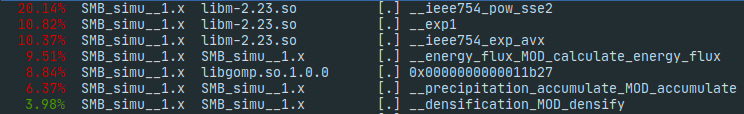
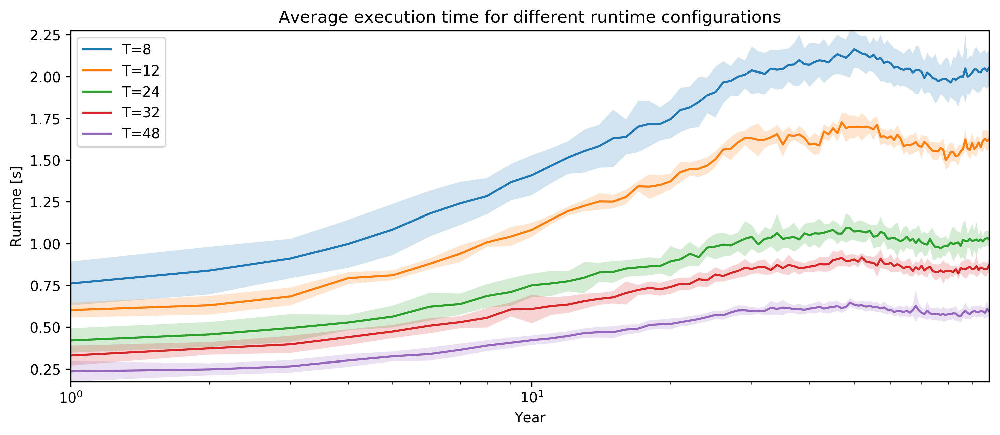
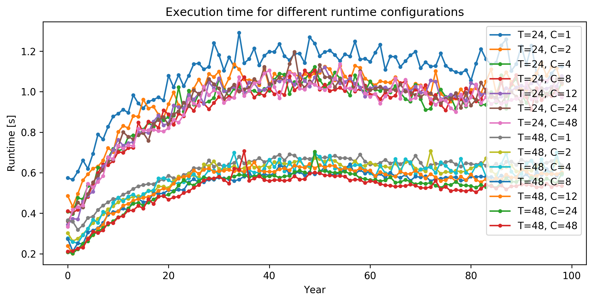
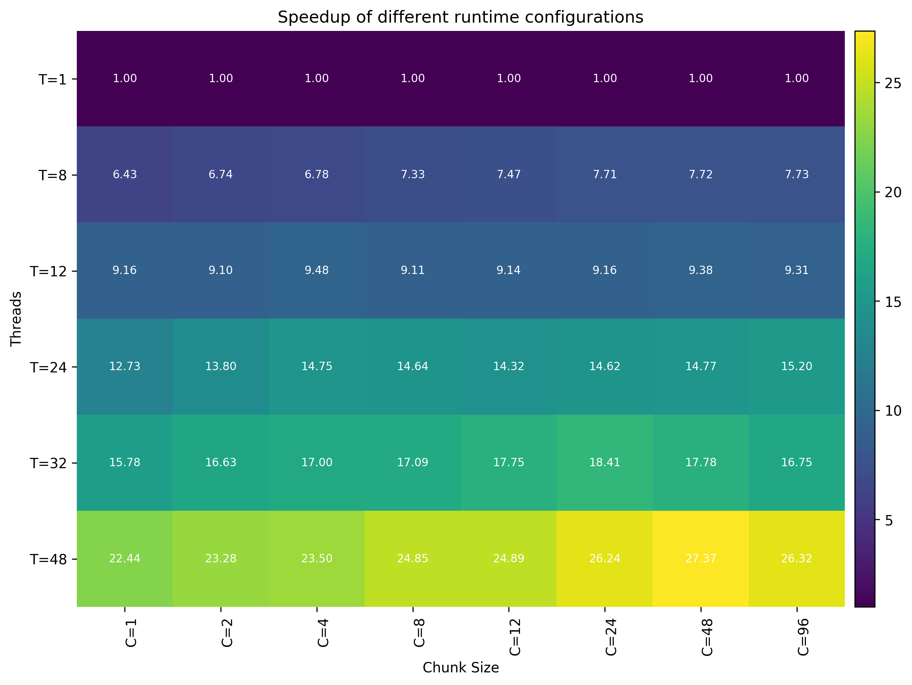

# Benchmark of BESSIv2.3 (OMP)

## Content
The following report is structured into the following sections:
- [Introduction](README.md#introduction) - Introduction and overview
- [Results](README.md#results) - Results


## Introduction
Performance analysis only for the main routine of BESSI (get_accumulation_snowman) and not for the wrapper and IO functions.
At the moment, the reading and writing of the climate data is the most expensive part. The actual computation only accounts
for around 50% of the whole execution time-

Thread pinning to avoid thread migration.

Looked at schedule static and dynamic. Dynamic was in average 2-4x slower than static with best chunk size.

Readspeed on /scratch2:
```bash
/dev/nvme0n1:
 Timing cached reads:   15384 MB in  1.99 seconds = 7718.17 MB/sec
 Timing buffered disk reads: 5382 MB in  3.00 seconds = 1793.39 MB/sec
```
Current readtime=1.5 for 800Mb

## Results
### General
Results of perf. Started using restart file which stopped at year=99. Bessi was then executed for 
11 more years.



It was found that calculate_energy_flux is the most expensive function, as __ieee754_pow_sse2, __exp1, and __ieee754_exp_avx are called during the execution of the aforementioned function.
The expensive computations are as follows
```fortran
ea = 610.8*exp(17.27*DewpT(ix, iy, time)/(DewpT(ix, iy, time)+237.3))

K(1) = dt_firn/c_i/snowman(ix, iy, 1)*((T_air)*D_sf+lwrd_l+sigma*(eps_snow*3.*(tempi(1))**4.) + &
        K_sw + K_lh+D_lf/p_air*(ea-es*1+es*22.46*272.62*snow_temp(ix,iy, 1)/(272.62+(snow_temp(ix,iy, 1)-kelvin))**2))

```

Furthermore, due the short execution time of the main execution routine in Bessi, OpenMP is accountable for some overhead.
This is most likely due to the creation and termination of the runtime threads in the main execution routine. \
In compilers, such as ifort, it is possible to prevent the termination of these idle threads. This behaviour results in a
unportable usage of the OpenMP runtime.


### Execution Time
Average            |  Fastest
:-------------------------:|:-------------------------
   |  

Average shows execution time with different number of threads, averaged over the runs with different chunk sizes. \
Fastest shows the execution time of $`T=24`$ and $`T=48`$ with all chunk sizes. The almost two-fold speedup can easily be seen. These findings are further supported by the [Scaling](README.md#scaling) experiment

### Scaling
Look at how the computation scales with the number of threads. 

 

Average taken, starting from computation year 80.
The best execution configuration is shown to be $`(T=48, C=48)`$. This shows that the usage of the hyper-threading feature in the available CPU results in a higher performance.

In general, BESSI does scale fairly well after running for approximately 40 simulation years. At much lower number of years, only marginal improvements are noticable. \
Comparing the best performing configuration (```T=48```), the strong scaling experiment results in a speedup of $`S=27`$ and efficiency $`\epsilon = 0.57`$  over the naive single-thread version.

Weak scaling might likely increase $`\epsilon`$ due to the higher computational intensity and lower overhead.

Nevertheless, it is still possible to achieve better scaling.

### Memory and Cache
The cache efficiency was extracted using ```perf stat -B -e cache-references,cache-misses,cycles,instructions,branches,faults,migrations``` resulting in:

```bash
3044338873      cache-references                                            
1599499081      cache-misses              #   52.540 % of all cache refs
```
With approx. 50% cache-misses, much time is likely spend in continuously fetching the correct cache lines.
How is it possible to lower the cache-misses?!
