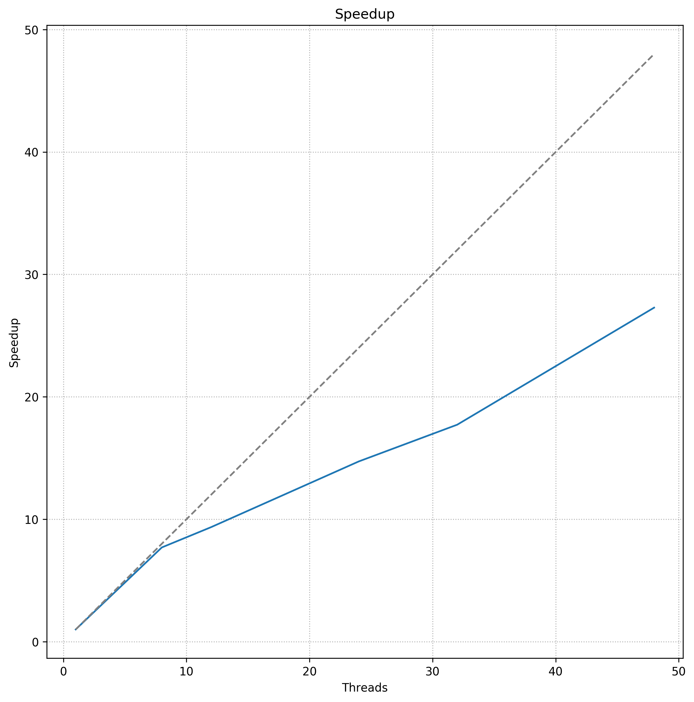

# Benchmark of BESSIv2.3 (OMP)


## Content
The following report is structured into the following sections:
- [Introduction](README.md#introduction) - Introduction and overview
- [Results](README.md#results) - Results


## Introduction
Performance analysis was only performed for the main routine of BESSI (get_accumulation_snowman) and not for the wrapper and I/O functions itself.
At the moment, the reading and writing of the climate data is the most expensive part. Depending on the grid size, the actual computation only accounts for around 20% - 50% of the whole execution time.

Before the performance analysis and benchmarking could be performed, BESSI was optimized and re-written for parallel execution on shared-memory architectures.

In order to locate and explore the limiting factors during execution, the following topics were investigated:
- I/O
- Expensive computations
- Loop scheduling strategy
- Runtime configurations
- Memory and Cache access


## Results
This section summarizes all results obtained during benchmarking. All results were obtained on the MELT system.
The MELT system is a 24-core, shared memory (two NUMA domains), x86 architecture running two Intel Xeon Gold 6136.

During the benchmarking, the system was exclusively used for BESSI. The utilized BESSI version is contained in this repository.

In order to avoid thread migration while execution, all threads were pinned to their respective core. This applies to all runs.

### I/O
During execution, BESSI reads climate files during each iteration. Depending on the utilized climate (e. g. constant climate) BESSI reads one climate file per iteration.

During benchmarking, the input files are located in /scratch2. The readspeed for this disk is as follows:
```bash
/dev/nvme0n1:
 Timing cached reads:   15384 MB in  1.99 seconds = 7718.17 MB/sec
 Timing buffered disk reads: 5382 MB in  3.00 seconds = 1793.39 MB/sec
```
During execution, BESSI reports a overal readtime of ```~1.5s``` per climate file of size ```800Mb```. Thus, the I/O functions only utilize
```~30%``` of the actual read speed available.

In conclusion, the current limiting factors are memory size, memory speed, and disk read speed. Due to the comparatively small data size writte to disk,
writing can be neglected.


### Expensive computations
In order to locate expensive computations, performance analysis using perf was performed. Results obtained with perf show. 

The execution duration of BESSI is heavily dependent on the amount of calculated years, as the grid (and layers) initially contain few values.
During preliminary runs, the execution duration of each iteration converged after 60 years. During the analysis, BESSI was initialized using a restart file (100 year runtime) and then executed for 11 more years.


As can be seen, the most computation expensive calculation is ```calculate_energy_flux()```. Furthermore, the power and exponential function are computationally also very expensive.

In ```calculate_energy_flux()``` some of the expensive computations are as follows:
```fortran
ea = 610.8*exp(17.27*DewpT(ix, iy, time)/(DewpT(ix, iy, time)+237.3))

K(1) = dt_firn/c_i/snowman(ix, iy, 1)*((T_air)*D_sf+lwrd_l+sigma*(eps_snow*3.*(tempi(1))**4.) + ...)

```

Additional, due the short execution time of the main execution routine in Bessi, OpenMP is accountable for some overhead (see libgomp.so in the figure above).
This is most likely due to the creation and termination of the runtime threads in the main execution routine. \
In compilers, such as ifort, it is possible to prevent the termination of these idle threads. This behaviour results in a
unportable usage of the OpenMP runtime.


### Loop scheduling and runtime configuration
OpenMP allows many runtime configurations, such as the number of threads and loop scheduling. In order to determine the best configuration,
the scheduling type, schedule size $`C`$, and number of threads $`T`$ was varied.

The following results show the runtime of each BESSI iteration for different configuration.

Average            |  Fastest
:-------------------------:|:-------------------------
   |  

Average (see figure left) shows the execution time with different number of threads, averaged over multiple runs with different $`C`$. 
Loop scheduling is set to ```static```.
While the same analysis was performed using a ```dynamic``` loop scheduling, the results are omitted as now improvement was recorded. In general, this loop scheduling results in runtime 2-4x longer than runtimes obtained with static. 

Fastest (see figure right) shows the execution time of $`T=24`$ and $`T=48`$ with varying $`C`$. The almost two-fold speedup can easily be seen. These findings are further supported by the [Scaling](README.md#scaling) experiment


### Scaling
In order to determine the best runtime configuration, BESSI was executed with configurations taken from $`\{(T, C)\} = \{1, 8, 12, 24, 32, 48\} \times \{1, 2, 4, 8, 12, 24, 48, 96\}`$. Furthermore, the strong scaling behaviour is examined.

Configuration scaling            |  Optimal scaling
:-------------------------:|:-------------------------
 | 

For both figure, BESSI was executed for 100 years. Results shown are averages starting from year 80.
The best execution configuration is shown to be $`(T=48, C=48)`$. It is interesting to see that hyper-threading ($`T=48`$) resulted in the best performance. It can be inferred, that threads are halted during memory access instructions due to cache-misses. This is further investigated in [Memory and cache efficiency](README.md#memory-and-cache-efficiency). 

In general, BESSI does scale fairly well after running for approximately 40 simulation years. At much lower number of years, only marginal improvements are noticable. \
Comparing the best performing configuration (```T=48```), the strong scaling experiment results in a speedup of $`S=27`$ and efficiency $`\epsilon = 0.57`$  over the naive single-thread version.

Weak scaling might likely increase $`\epsilon`$ due to the higher computational intensity and lower overhead. Nevertheless, it is still possible to achieve better scaling.


### Memory and Cache efficiency
The cache efficiency was extracted using ```perf stat -B -e cache-references,cache-misses,cycles,instructions,branches,faults,migrations``` resulting in:

```bash
3044338873      cache-references                                            
1599499081      cache-misses              #   52.540 % of all cache refs
```
With approx. 50% cache-misses, much time is likely spend in continuously fetching the correct cache lines.

BESSI contains many global variables which are allocated on one NUMA domain. Threads from another NUMA domain thus have a bigger access
latency accessing and writing to these variables. Numactl shows that accessing another NUMA domain is twice as expensive as a local access.
